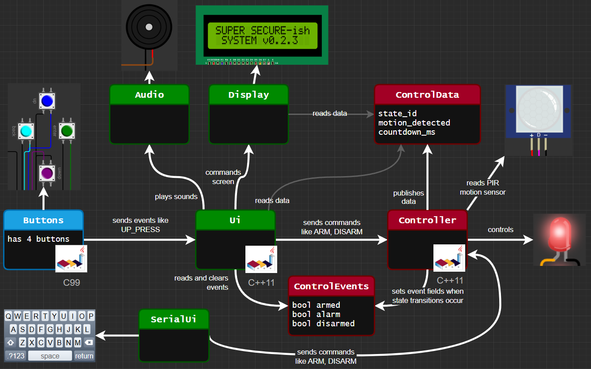
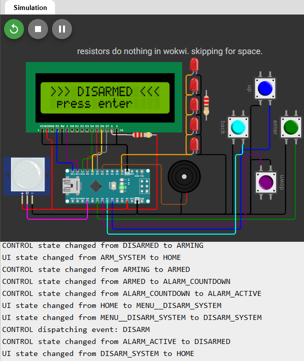
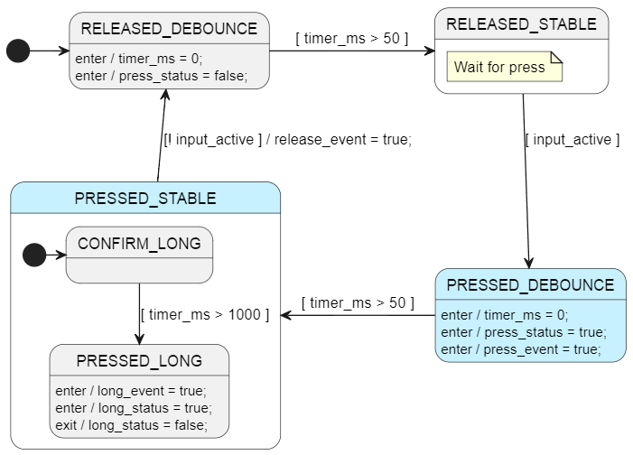
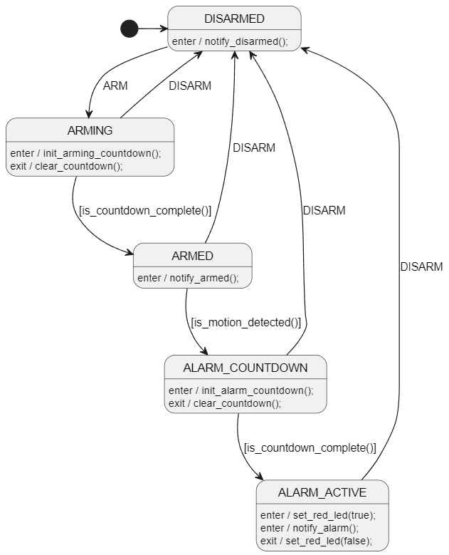
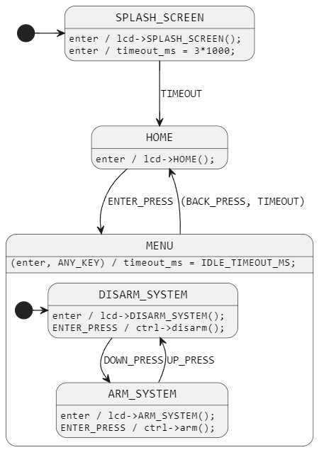
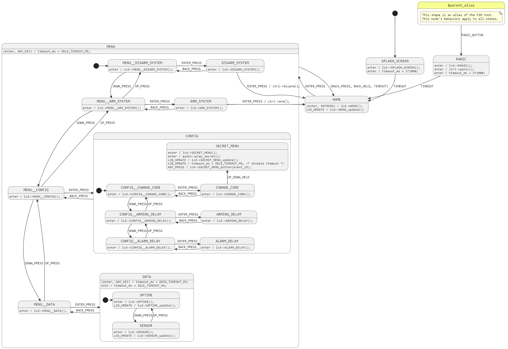

# SUPER SECURE-ish
This project shows how to connect various state machines and software components together to create a functioning Security System. It has lots of cool features: 
- Audio System - plays melodies for events
- Button System - only 5 bytes of RAM per button, highly flexible
- User Interface - nested LCD menu, secret menu, idle timeouts, live updates, ...
- Control System - implements actual alarm system logic and states
- Serial UI - shows how we can wire up another user interface into our system



```
MAIN MENU
├── DISARM_SYSTEM
│   └── CONFIRM DISARM
├── ARM_SYSTEM
│   └── CONFIRM ARM
├── CONFIG
│   ├── CHANGE_CODE
│   │   └── editing not implemented. Hold UP + DOWN keyboard keys to get to secret menu.
│   │       └── SECRET MENU 
│   ├── ARMING_DELAY
│   │   └── editing not implemented
│   └── ALARM_DELAY
│       └── editing not implemented
└── LIVE DATA VIEW
    ├── UPTIME
    └── SENSOR STATUS
```

## Embedded Online Conference Video Walkthrough
If you are interested in a video walk through of this design, you can check out my [Embedded Online Conference talk here](https://embeddedonlineconference.com/session/Visualize_Your_State_Machines).

I don't make any money from the conference. Just happy to share embedded & state machine ideas with a wide audience :)

[](https://embeddedonlineconference.com/session/Visualize_Your_State_Machines)


## Online Hardware Simulation
You can simulate the full project online for free [using wokwi](https://wokwi.com/projects/425266535976055809).

[](https://wokwi.com/projects/425266535976055809)

This project uses an AVR8 Arduino board because it compiles the quickest on wokwi.

## State Machines
A few parts of this system use hand written state machines for simple, small or linear sequences. Like the audio subsystem. This is good. Trivial state machines don't need a diagram or code generation.

However, we do use [StateSmith](https://github.com/StateSmith/StateSmith) to code generate 3 non-trivial state machines:
- The Button subsystem runs a state machine for each button and sends events like `UP_PRESS`, `BACK_PRESS` and `BACK_HELD` to the User Interface subsystem.
    - FSM uses `C99` and a `model based` pattern (FSM reads input vars, sets output vars).
- The User Interface has its own state machine mainly for the LCD menu. It plays sounds, commands screens, and sends commands like ARM and DISARM to the Controller subsystem.
    - FSM uses `C++11` and `composition` to directly call methods on the audio, display and controller objects.
- The Controller subsystem reads the motion sensor, and controls the alarm.
    - FSM uses `C++11` and `inheritance` to call methods defined by child class. Very testable.

Note that this project isn't a tutorial on how to use StateSmith. If you need tips, see [StateSmith learning resources](https://github.com/StateSmith/StateSmith/wiki/Learning-Resources).

## Production Ready?
The design here isn't feature complete, but it does provide a simple and flexible foundation that I've used in the past to build commercial products. It notably lacks automated tests, some abstractions/interfaces that would make it more portable and testable (specifically for the HAL), and a UI "edit" capability for config settings like "arming delay".


<br>
<br>


# Let's Break It Down
To make it easier to understand, I've broken down the design into examples that build towards the full solution.

## Example 1 (ex1)
In this example, we focus on getting a single button state machine working.

The button design provides the following features:
- button debouncing
- events for: press, long press, release
- status for: press, long press
- press timing




## Example 2 (ex2)
In `ex2`, we wire up 4 button state machines to a simple UI and add a basic control state machine as well.

Simple Control FSM:



Simple UI FSM:




## Example 3 (ex3)
And then finally in `ex3`, we have the full blown system which adds stuff like:
- special button combination detection
    - hold `UP` + `DOWN` for 2 seconds to send `UP_DOWN_HELD` to UI. Required for entering secret menu from `CHANGE_CODE` screen.
    - hold `LEFT` + `RIGHT` for 2 seconds on any screen to send Panic input event.
- Panic feature (AKA "alarm now")
- many more menu pages
    - secret menu that plays Final Fantasy 7 melody and reacts to button presses
- code generating PlantUML menu
    - its easy enough to write by hand, but PlantUML + StateSmith has some interesting potential.
- detecting FSM events that are ignored
- storing FSM events in a variable for advanced usage
    - used to send button events to secret menu display
- trigger maps

Full UI FSM:




<!-- 
WOKWI notes:

- Use the menu to ARM and DISARM the system.
- When armed, trip the motion sensor.
- buttons are mapped to keyboard arrows. Need to click a button first though.
    - this allows holding buttons at the same time.
- supported terminal commands 'a' = ARM, 'd' = DISARM, 'p' = PANIC

MAIN MENU
---- DISARM_SYSTEM
-------- CONFIRM DISARM
---- ARM_SYSTEM
-------- CONFIRM ARM
---- CONFIG
-------- CHANGE_CODE
------------ editing not implemented. Hold UP + DOWN keyboard keys to get to secret menu.
---------------- SECRET MENU
-------- ARMING_DELAY
------------ editing not implemented
-------- ALARM_DELAY
------------ editing not implemented
---- LIVE DATA VIEW
-------- UPTIME
-------- SENSOR STATUS
-->

<!-- 
https://www.text-tree-generator.com/
MAIN MENU
= DISARM_SYSTEM
== CONFIRM DISARM
= ARM_SYSTEM
== CONFIRM ARM
= CONFIG
== CHANGE_CODE
=== editing not implemented. Hold UP + DOWN keyboard keys to get to secret menu.
==== SECRET MENU
== ARMING_DELAY
=== editing not implemented
== ALARM_DELAY
=== editing not implemented
= LIVE DATA VIEW
== UPTIME
== SENSOR STATUS
-->
