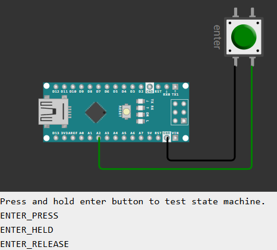

# Let's start simple
We will create a simple button sensing state machine.

# Prerequisites
Please [download or install](https://github.com/StateSmith/StateSmith/releases) `ss.cli` v0.18.2 or greater as this tutorial uses new features.

Works with Windows, Linux, Mac.


# Online Hardware Simulation
See https://wokwi.com/projects/428897490626850817

[](https://wokwi.com/projects/428897490626850817)


# Steps
Follow the below steps to recreate the button state machine files in this `ex1` directory.

1. open your text editor of choice in directory `ex1`.
1. delete existing button files `rm ButtonSm.*`
1. generate a new `ButtonSm` PlantUML StateSmith project using `ss.cli create`
1. run `ss.cli run *.plantuml --watch` and edit `ButtonSm.plantuml` file.
    1. add states
    1. add behaviors
    1. add config

<br>

## 🎞️ Near live code generation
Small 3 minute video showing near live code generation for this project: https://www.youtube.com/watch?v=KpE2qmLzDc8


## Add States
Add these states:
```
- RELEASED_DEBOUNCE
- RELEASED_STABLE
- PRESSED_DEBOUNCE
- PRESSED_STABLE
    - CONFIRM_LONG
    - PRESSED_LONG
```

PlantUML:
```plantuml
state RELEASED_DEBOUNCE
state RELEASED_STABLE {
    note "Wait for press" as N1
}
state PRESSED_DEBOUNCE <<press_style>>
state PRESSED_STABLE <<press_style>> {
    [*] -> CONFIRM_LONG
    state CONFIRM_LONG
    state PRESSED_LONG
}

[*] -> RELEASED_DEBOUNCE
```

## Behaviors
```plantuml
' RELEASED_DEBOUNCE. Wait for debounce time and then go to stable state.
RELEASED_DEBOUNCE: enter / timer_ms = 0;
RELEASED_DEBOUNCE: enter / press_status = false;
RELEASED_DEBOUNCE -> RELEASED_STABLE: [ timer_ms > 50 ]

' RELEASED_STABLE. Button is released. Wait for button press.
RELEASED_STABLE -down-> PRESSED_DEBOUNCE: [ input_active ]

' PRESSED_DEBOUNCE. Wait for debounce time and then go to stable state.
PRESSED_DEBOUNCE: enter / timer_ms = 0;
PRESSED_DEBOUNCE: enter / press_status = true;
PRESSED_DEBOUNCE: enter / press_event = true;
PRESSED_DEBOUNCE -left-> PRESSED_STABLE: [ timer_ms > 50 ]

' PRESSED_STABLE. Button is pressed. Wait for button release.
PRESSED_STABLE -up-> RELEASED_DEBOUNCE: [! input_active ] / release_event = true;

' CONFIRM_LONG. Button is still pressed. Wait for long press time.
CONFIRM_LONG --> PRESSED_LONG: [ timer_ms > 1000 ]

' PRESSED_LONG. Button has been pressed for a long time.
PRESSED_LONG: enter / long_event = true;
PRESSED_LONG: enter / long_status = true;
PRESSED_LONG: exit / long_status = false;
```

## Add StateSmith config
Replace StateSmith config toml in `ButtonSm.plantuml` file with this:

```toml
SmRunnerSettings.transpilerId = "C99"

# allows easy linking C files into C++ project
RenderConfig.C.HFileUseExternC = true

RenderConfig.C.HFileIncludes = """
    #include <stdint.h> // for fixed width integer state machine variables below
    """

RenderConfig.AutoExpandedVars = """
    // INPUTs
    uint16_t timer_ms;
    uint8_t input_active: 1;

    // OUTPUTs
    uint8_t release_event: 1;
    uint8_t press_event: 1;
    uint8_t long_event: 1;
    uint8_t press_status: 1;
    uint8_t long_status: 1;
    """

# Declare generated enumerations as "packed" for GCC. Often saves some RAM/flash. Not needed for C++11 transpiler.
RenderConfig.C.CEnumDeclarer = "typedef enum __attribute__((packed)) {enumName}"
```
